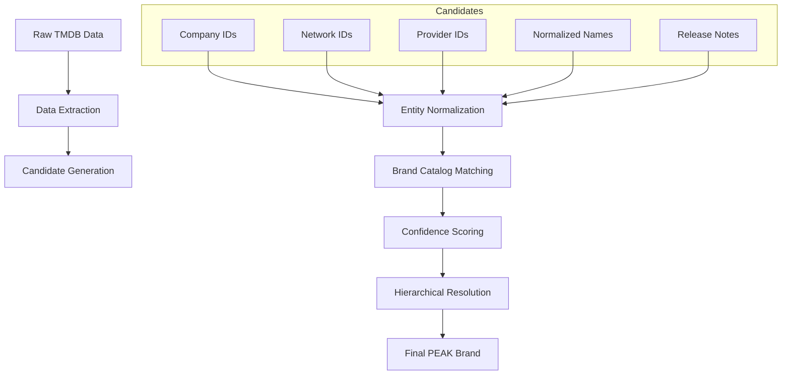

# Forensic Audit: Brand Identification System

## 1. Current Architecture Analysis

### Data Flow
1. **Fetch**: `TmdbApi.getMovieDetails` / `getTvDetails` retrieves `TmdbMovie` DTO.
2. **Map**: `TmdbMovie.toEnrichedMovie` calls `ProductionCompanyRecognition.findBestCompany`.
3. **Resolve**: `findBestCompany` performs a lookup in `ProductionCompanyIndex` (Hardcoded Map).
4. **Domain**: `Movie.productionCompany` stores the resulting string.
5. **UI**: `HeroSection.kt` displays the string as a badge.

### Limitations
- **ID Over-Reliance**: The system is a strict whitelist of TMDB IDs.
- **Fragmented Brands**: Multiple IDs for the same brand (e.g., Sony vs. Columbia) must be manually mapped.
- **Manual Maintenance**: Adding a title with a new regional subsidiary (e.g., "Lionsgate UK") requires a code change to the index.
- **Limited Signals**: Only uses `production_companies` and `networks`. Ignores distribution and streaming provider data.
- **Binary Recognition**: If a company is 1 ID away from a known brand, it is ignored.

---

## 2. TMDB Data Audit

### A. Currently Utilized
- `production_companies` (ID, Name)
- `networks` (ID, Name) - TV only
- `release_dates` (Certification only)

### B. Available but Unused (Potential Signals)
- **`watch/providers`**: Crucial for identifying streaming originals (Netflix, Apple TV+, Prime).
- **`release_dates` details**: The `note` field often contains the distributor name (e.g., "Universal Pictures").
- **`keywords`**: Can indicate brand universes (e.g., "Marvel Cinematic Universe").
- **Name Strings**: The names of companies can be normalized and matched against patterns.

---

## 3. Proposed Brand Intelligence Architecture

### Core Concepts
1. **Brand Identity**: A top-level entity (e.g., "SONY_PICTURES").
2. **Multi-Signal Detection**:
    - **Tier 1: Explicit IDs**: Whitelisted TMDB IDs (High Confidence).
    - **Tier 2: Provider Match**: Streaming provider IDs (High Confidence for "Originals").
    - **Tier 3: Name Patterns**: Regex/Fuzzy matching on normalized strings (Medium Confidence).
    - **Tier 4: Distributor Notes**: Matching brand names in release metadata (Medium Confidence).

### Resolution Pipeline

---

## 4. Normalization & Matching Strategy

### Entity Normalization
- Remove corporate suffixes: `Pictures`, `Studios`, `Films`, `Entertainment`, `Ltd`, `Inc`.
- Remove regional indicators: `UK`, `US`, `International`.
- Standardize casing and whitespace.

### Brand Catalog Structure
Instead of a simple ID map, use a `BrandDefinition`:
- `id`: Unique key.
- `displayName`: How it appears in PEAK.
- `tier`: Priority (PREMIER, MAJOR, etc.).
- `patterns`: Regex patterns for name matching (e.g., `^lions\s*gate.*`).
- `whitelistedIds`: Known IDs for this brand.
- `providerIds`: TMDB provider IDs for streaming brands.

---

## 5. Performance & Safety

- **Deterministic**: Logic is local and based on provided metadata.
- **Fast**: Regex matching is pre-compiled; no extra network hops per title.
- **Fail-Safe**: If no candidate meets the **Confidence Threshold**, return no badge.
- **Rare Overrides**: Title-specific overrides are handled by a small Map of `tmdb_id -> brand_key`.

---

## 6. Case Study: Mutiny (ID 1288445)

**Current Result**: `""` (Companies "Punch Palace" and "MadRiver" are not in the whitelist).

**Proposed System Handling**:
1. **Scan Companies**: "Punch Palace" and "MadRiver" Normalized -> No match in Catalog.
2. **Scan Providers**: If `watch/providers` contains "Lionsgate" (ID 1632) -> Match: **Lionsgate**.
3. **Scan Release Notes**: If `release_dates` (US) note contains "Lionsgate" -> Match: **Lionsgate**.
4. **Resolution**: Lionsgate matches as a **MAJOR** brand -> Display: **LIONSGATE**.
5. **No Match?**: If no signal identifies a major brand, correctly display **no badge** rather than guessing.
